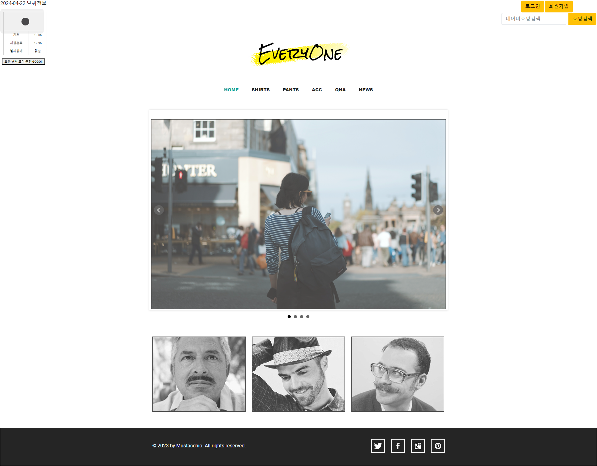
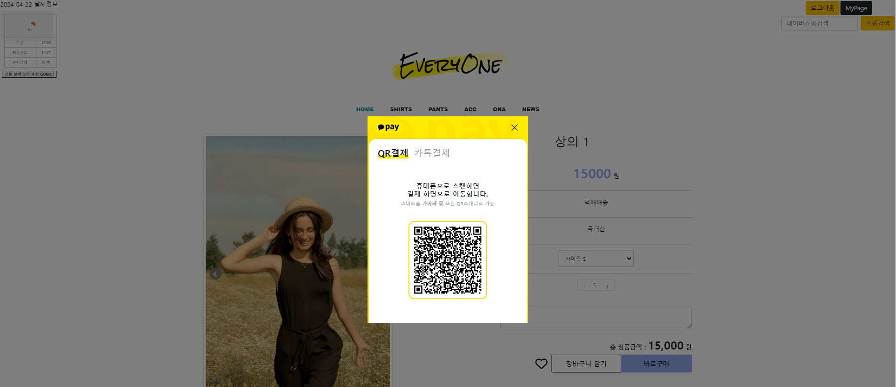
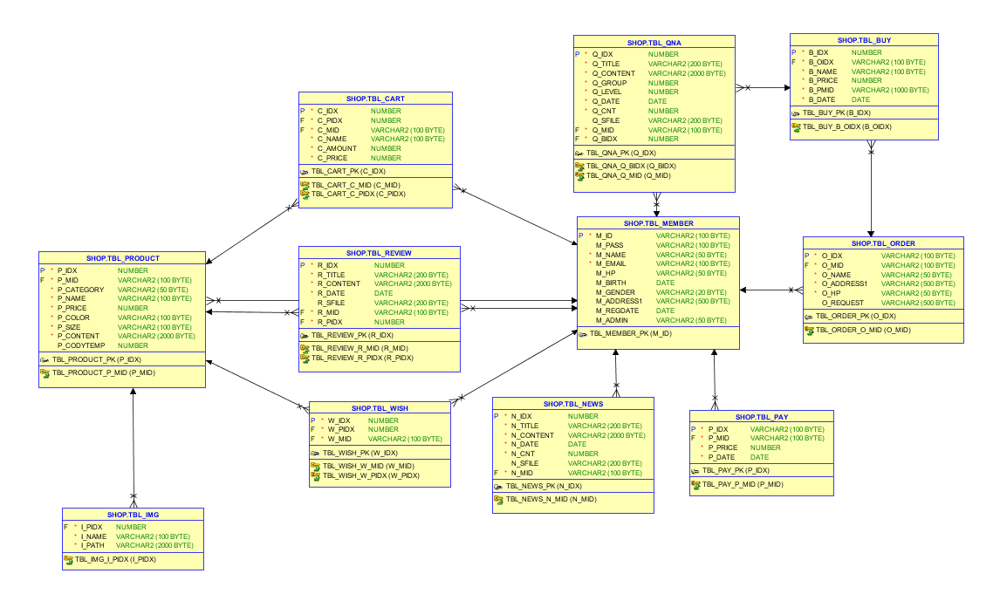

***

# :sparkles:개요
  * 프로젝트명
    
    EveryOne 쇼핑몰
    
  * 기간

     2024.04.01 ~ 2024.04.
    
  * 팀원
     * Leader : 원기(<http://github.com/TrendFollow>)
     * Member : 민진(<https://github.com/mingmingbae>)
     * Member : 정아(<https://github.com/JungahKwon>)
     * Member : 주원(<https://github.com/manabaha>)
     * Member : 지민(<https://github.com/jjiminh>)
  * 목차
     * [개발 환경](#개발-환경)

       
     * [구현한 기능들](#구현한-기능들)

***

# :sunny:개발 환경

   VIEW 
    
       

   DB 
     
      
     
  Server
     
    
  
   개발 환경
     
    
    
      
  개발 언어
     
    
     
   
  사용 API
      
   * 네이버 로그인 API
     
       <https://developers.naver.com/products/login/api/api.md>
   * 카카오 로그인 API
        
       <https://developers.kakao.com/docs/latest/ko/kakaologin/common>
   * 아임포트 API (카카오 결제)

       <https://developers.portone.io/api/rest-v1/pg>
   * 네이버 검색 API
    
       <https://developers.naver.com/products/service-api/search/search.md>
   * 날씨 정보 API
    
       <https://openweathermap.org/api> 
           
***

# :hatched_chick:구현한 기능들
  * 메인화면

     

***
   
  * 회원정보 
    * 회원가입
        
    * 로그인
       * 일반 로그인   
       * 네이버 로그인
       * 카카오 로그인
             
    * 마이페이지
       * 회원 정보 수정
       * 회원 탈퇴
       * 장바구니
        
  * 상품관련
    * 상품목록
    * 상세페이지
      * Wish
      * Review
    * 관리자 상품 등록
    * 관리자 상품 수정

  * 문의사항 게시판
          
  * 공지사항 게시판

***

  * 아임포트 결제
    

***
    
  * API
    * 네이버 검색 API
    * 날씨 정보 API

***

# :shaved_ice:DB 구성

   

***   
     
## :carousel_horse:아쉬운 점
        

